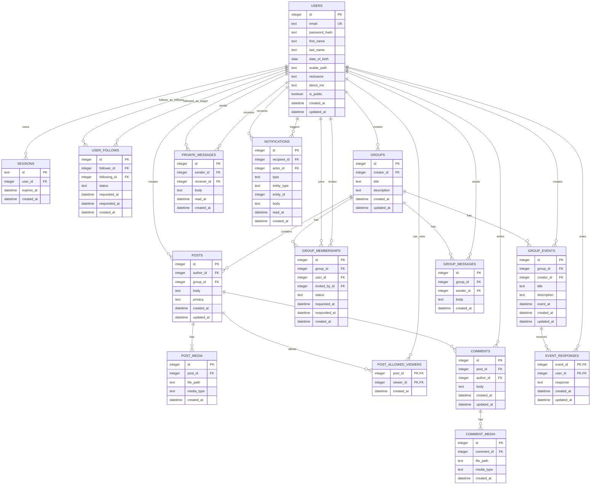

# Social Network ERD

This ERD is based on `projectdetails.md` and covers authentication, profiles, followers, posts, groups, events, chat, and notifications.

## Lucidchart-Friendly Mermaid ERD

Paste this Mermaid ERD into a Mermaid-compatible diagram tool, or use it as the table/relationship blueprint when creating the ERD in Lucidchart.



## Relationship And Constraint Notes

- `USERS.is_public` controls whether follow requests are auto-accepted or require approval.
- `USER_FOLLOWS.status` should allow `pending`, `accepted`, and `declined`. Add a unique constraint on `(follower_id, following_id)`.
- `POSTS.privacy` should allow `public`, `followers`, and `private`.
- `POSTS.group_id` is nullable. When present, the post belongs to a group and should only be visible to accepted group members.
- `POST_ALLOWED_VIEWERS` is only needed when `POSTS.privacy = 'private'`.
- `GROUP_MEMBERSHIPS.status` should allow `invited`, `requested`, `accepted`, and `declined`. Add a unique constraint on `(group_id, user_id)`.
- `EVENT_RESPONSES.response` should allow `going` and `not_going`. Its composite primary key prevents duplicate votes by the same user on the same event.
- `PRIVATE_MESSAGES` should only be allowed when at least one user follows the other, or when the recipient has a public profile as described in the chat requirement.
- `NOTIFICATIONS.entity_type` and `entity_id` let one notification point to a follow request, group membership request/invitation, event, post, or another workflow without requiring many nullable foreign keys.

## Suggested SQLite Implementation Order

1. `users`
2. `sessions`
3. `user_follows`
4. `groups`
5. `group_memberships`
6. `posts`
7. `post_media`
8. `post_allowed_viewers`
9. `comments`
10. `comment_media`
11. `group_events`
12. `event_responses`
13. `private_messages`
14. `group_messages`
15. `notifications`

## How To Create This In Lucidchart

Lucidchart access is not available from this coding session, so this project includes the ERD content in a form you can copy into Lucidchart manually.

Recommended Lucidchart workflow:

1. Create a new blank Lucidchart document.
2. Enable the Entity Relationship shape library.
3. Create one entity box for each table in the Mermaid ERD.
4. Add fields exactly as listed in each table.
5. Mark `PK`, `FK`, and `UK` fields using the labels in the Mermaid block.
6. Draw the one-to-many relationships listed after the table definitions.
7. Use the SQLite DDL below as the source of truth for constraints when creating migrations.

If your Lucidchart plan supports database import, use the SQL DDL below as the import source.

## SQLite DDL Draft

This DDL is a migration-ready draft. Split it into numbered migration files when implementing the backend database layer.

```sql
PRAGMA foreign_keys = ON;

CREATE TABLE users (
    id INTEGER PRIMARY KEY AUTOINCREMENT,
    email TEXT NOT NULL UNIQUE,
    password_hash TEXT NOT NULL,
    first_name TEXT NOT NULL,
    last_name TEXT NOT NULL,
    date_of_birth DATE NOT NULL,
    avatar_path TEXT,
    nickname TEXT,
    about_me TEXT,
    is_public BOOLEAN NOT NULL DEFAULT 0,
    created_at DATETIME NOT NULL DEFAULT CURRENT_TIMESTAMP,
    updated_at DATETIME NOT NULL DEFAULT CURRENT_TIMESTAMP
);

CREATE TABLE sessions (
    id TEXT PRIMARY KEY,
    user_id INTEGER NOT NULL,
    expires_at DATETIME NOT NULL,
    created_at DATETIME NOT NULL DEFAULT CURRENT_TIMESTAMP,
    FOREIGN KEY (user_id) REFERENCES users(id) ON DELETE CASCADE
);

CREATE TABLE user_follows (
    id INTEGER PRIMARY KEY AUTOINCREMENT,
    follower_id INTEGER NOT NULL,
    following_id INTEGER NOT NULL,
    status TEXT NOT NULL CHECK (status IN ('pending', 'accepted', 'declined')),
    requested_at DATETIME NOT NULL DEFAULT CURRENT_TIMESTAMP,
    responded_at DATETIME,
    created_at DATETIME NOT NULL DEFAULT CURRENT_TIMESTAMP,
    UNIQUE (follower_id, following_id),
    CHECK (follower_id <> following_id),
    FOREIGN KEY (follower_id) REFERENCES users(id) ON DELETE CASCADE,
    FOREIGN KEY (following_id) REFERENCES users(id) ON DELETE CASCADE
);

CREATE TABLE groups (
    id INTEGER PRIMARY KEY AUTOINCREMENT,
    creator_id INTEGER NOT NULL,
    title TEXT NOT NULL,
    description TEXT NOT NULL,
    created_at DATETIME NOT NULL DEFAULT CURRENT_TIMESTAMP,
    updated_at DATETIME NOT NULL DEFAULT CURRENT_TIMESTAMP,
    FOREIGN KEY (creator_id) REFERENCES users(id) ON DELETE CASCADE
);

CREATE TABLE group_memberships (
    id INTEGER PRIMARY KEY AUTOINCREMENT,
    group_id INTEGER NOT NULL,
    user_id INTEGER NOT NULL,
    invited_by_id INTEGER,
    status TEXT NOT NULL CHECK (status IN ('invited', 'requested', 'accepted', 'declined')),
    requested_at DATETIME NOT NULL DEFAULT CURRENT_TIMESTAMP,
    responded_at DATETIME,
    created_at DATETIME NOT NULL DEFAULT CURRENT_TIMESTAMP,
    UNIQUE (group_id, user_id),
    FOREIGN KEY (group_id) REFERENCES groups(id) ON DELETE CASCADE,
    FOREIGN KEY (user_id) REFERENCES users(id) ON DELETE CASCADE,
    FOREIGN KEY (invited_by_id) REFERENCES users(id) ON DELETE SET NULL
);

CREATE TABLE posts (
    id INTEGER PRIMARY KEY AUTOINCREMENT,
    author_id INTEGER NOT NULL,
    group_id INTEGER,
    body TEXT NOT NULL,
    privacy TEXT NOT NULL CHECK (privacy IN ('public', 'followers', 'private')),
    created_at DATETIME NOT NULL DEFAULT CURRENT_TIMESTAMP,
    updated_at DATETIME NOT NULL DEFAULT CURRENT_TIMESTAMP,
    FOREIGN KEY (author_id) REFERENCES users(id) ON DELETE CASCADE,
    FOREIGN KEY (group_id) REFERENCES groups(id) ON DELETE CASCADE
);

CREATE TABLE post_media (
    id INTEGER PRIMARY KEY AUTOINCREMENT,
    post_id INTEGER NOT NULL,
    file_path TEXT NOT NULL,
    media_type TEXT NOT NULL CHECK (media_type IN ('jpeg', 'png', 'gif')),
    created_at DATETIME NOT NULL DEFAULT CURRENT_TIMESTAMP,
    FOREIGN KEY (post_id) REFERENCES posts(id) ON DELETE CASCADE
);

CREATE TABLE post_allowed_viewers (
    post_id INTEGER NOT NULL,
    viewer_id INTEGER NOT NULL,
    created_at DATETIME NOT NULL DEFAULT CURRENT_TIMESTAMP,
    PRIMARY KEY (post_id, viewer_id),
    FOREIGN KEY (post_id) REFERENCES posts(id) ON DELETE CASCADE,
    FOREIGN KEY (viewer_id) REFERENCES users(id) ON DELETE CASCADE
);

CREATE TABLE comments (
    id INTEGER PRIMARY KEY AUTOINCREMENT,
    post_id INTEGER NOT NULL,
    author_id INTEGER NOT NULL,
    body TEXT NOT NULL,
    created_at DATETIME NOT NULL DEFAULT CURRENT_TIMESTAMP,
    updated_at DATETIME NOT NULL DEFAULT CURRENT_TIMESTAMP,
    FOREIGN KEY (post_id) REFERENCES posts(id) ON DELETE CASCADE,
    FOREIGN KEY (author_id) REFERENCES users(id) ON DELETE CASCADE
);

CREATE TABLE comment_media (
    id INTEGER PRIMARY KEY AUTOINCREMENT,
    comment_id INTEGER NOT NULL,
    file_path TEXT NOT NULL,
    media_type TEXT NOT NULL CHECK (media_type IN ('jpeg', 'png', 'gif')),
    created_at DATETIME NOT NULL DEFAULT CURRENT_TIMESTAMP,
    FOREIGN KEY (comment_id) REFERENCES comments(id) ON DELETE CASCADE
);

CREATE TABLE group_events (
    id INTEGER PRIMARY KEY AUTOINCREMENT,
    group_id INTEGER NOT NULL,
    creator_id INTEGER NOT NULL,
    title TEXT NOT NULL,
    description TEXT NOT NULL,
    event_at DATETIME NOT NULL,
    created_at DATETIME NOT NULL DEFAULT CURRENT_TIMESTAMP,
    updated_at DATETIME NOT NULL DEFAULT CURRENT_TIMESTAMP,
    FOREIGN KEY (group_id) REFERENCES groups(id) ON DELETE CASCADE,
    FOREIGN KEY (creator_id) REFERENCES users(id) ON DELETE CASCADE
);

CREATE TABLE event_responses (
    event_id INTEGER NOT NULL,
    user_id INTEGER NOT NULL,
    response TEXT NOT NULL CHECK (response IN ('going', 'not_going')),
    created_at DATETIME NOT NULL DEFAULT CURRENT_TIMESTAMP,
    updated_at DATETIME NOT NULL DEFAULT CURRENT_TIMESTAMP,
    PRIMARY KEY (event_id, user_id),
    FOREIGN KEY (event_id) REFERENCES group_events(id) ON DELETE CASCADE,
    FOREIGN KEY (user_id) REFERENCES users(id) ON DELETE CASCADE
);

CREATE TABLE private_messages (
    id INTEGER PRIMARY KEY AUTOINCREMENT,
    sender_id INTEGER NOT NULL,
    receiver_id INTEGER NOT NULL,
    body TEXT NOT NULL,
    read_at DATETIME,
    created_at DATETIME NOT NULL DEFAULT CURRENT_TIMESTAMP,
    CHECK (sender_id <> receiver_id),
    FOREIGN KEY (sender_id) REFERENCES users(id) ON DELETE CASCADE,
    FOREIGN KEY (receiver_id) REFERENCES users(id) ON DELETE CASCADE
);

CREATE TABLE group_messages (
    id INTEGER PRIMARY KEY AUTOINCREMENT,
    group_id INTEGER NOT NULL,
    sender_id INTEGER NOT NULL,
    body TEXT NOT NULL,
    created_at DATETIME NOT NULL DEFAULT CURRENT_TIMESTAMP,
    FOREIGN KEY (group_id) REFERENCES groups(id) ON DELETE CASCADE,
    FOREIGN KEY (sender_id) REFERENCES users(id) ON DELETE CASCADE
);

CREATE TABLE notifications (
    id INTEGER PRIMARY KEY AUTOINCREMENT,
    recipient_id INTEGER NOT NULL,
    actor_id INTEGER,
    type TEXT NOT NULL,
    entity_type TEXT,
    entity_id INTEGER,
    body TEXT NOT NULL,
    read_at DATETIME,
    created_at DATETIME NOT NULL DEFAULT CURRENT_TIMESTAMP,
    FOREIGN KEY (recipient_id) REFERENCES users(id) ON DELETE CASCADE,
    FOREIGN KEY (actor_id) REFERENCES users(id) ON DELETE SET NULL
);

CREATE INDEX idx_sessions_user_id ON sessions(user_id);
CREATE INDEX idx_user_follows_follower_id ON user_follows(follower_id);
CREATE INDEX idx_user_follows_following_id ON user_follows(following_id);
CREATE INDEX idx_posts_author_id ON posts(author_id);
CREATE INDEX idx_posts_group_id ON posts(group_id);
CREATE INDEX idx_comments_post_id ON comments(post_id);
CREATE INDEX idx_group_memberships_group_id ON group_memberships(group_id);
CREATE INDEX idx_group_memberships_user_id ON group_memberships(user_id);
CREATE INDEX idx_group_events_group_id ON group_events(group_id);
CREATE INDEX idx_private_messages_pair ON private_messages(sender_id, receiver_id);
CREATE INDEX idx_group_messages_group_id ON group_messages(group_id);
CREATE INDEX idx_notifications_recipient_read ON notifications(recipient_id, read_at);
```

## Current Task Alignment Review

The current tasks in `tasks.md` are aligned with the project details, but they cover only part of the required social network.

Aligned tasks:

- Issue #7 maps directly to the Followers and Profile privacy requirements.
- Issue #12 maps directly to global Notifications and real-time WebSocket delivery.
- Issue #15 maps directly to Group Events, including going/not-going responses.
- The frontend tasks correctly mirror the backend work for these three features.

Missing or not yet represented by the current tasks:

- Authentication registration/login/logout with persistent sessions and cookies.
- User profile page data beyond follow controls: public/private toggle, user info, activity, followers, and following lists.
- Post creation, post privacy, comments, and image/GIF uploads.
- Group creation, group browsing, group invitations, group join requests, and group post/comment visibility.
- Private user chat and group chat persistence.
- Docker image setup for both backend and frontend.
- SQLite migration setup under a migration directory.

Recommended additional task groups:

- Authentication and session lifecycle.
- Profile visibility and profile activity.
- Posts, comments, media uploads, and post privacy.
- Group lifecycle and membership workflow.
- Private and group chat persistence.
- Docker and migration infrastructure.
